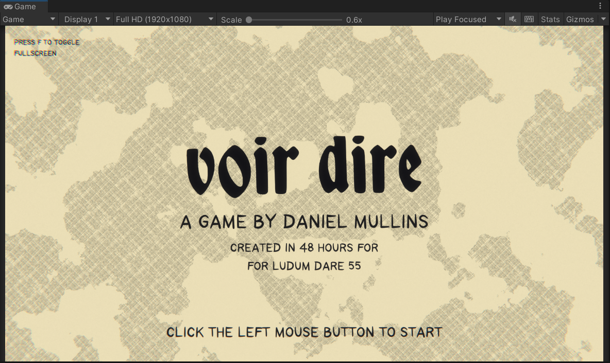
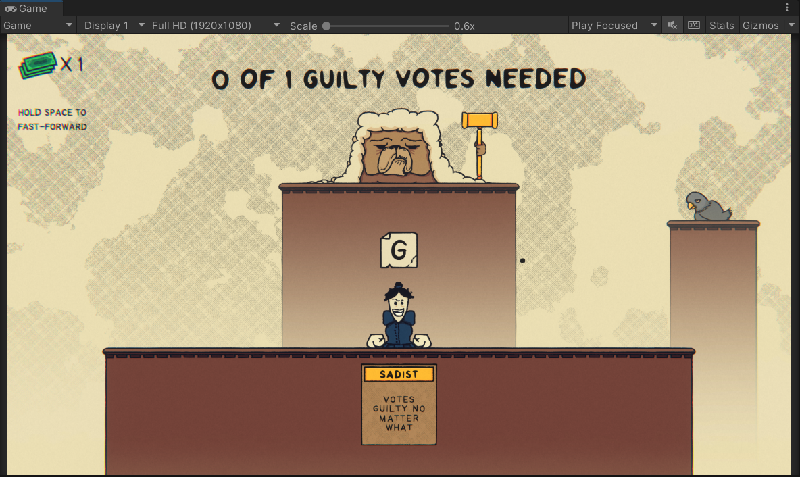
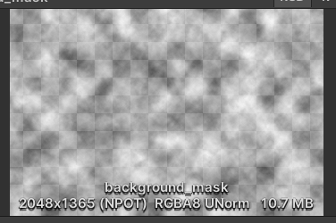
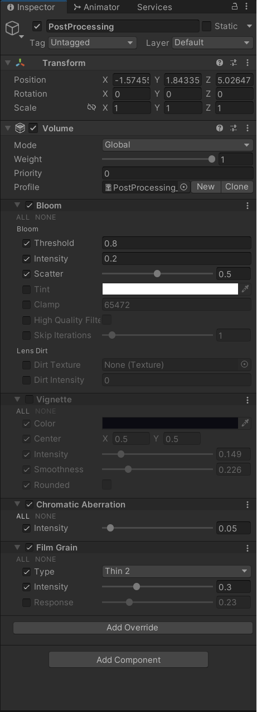

# Voir Dire (Ludum Dare 55)

## URL
https://jam.ludumdare.com/events/ludum-dare/55/voir-dire

https://github.com/nirvana233/LD55.git

## 描述
一款2D游戏，律师题材。画面比较精美，动画做的很好，代码层面东西不算很多很复杂，主要是动画那些比较多。动画有些是自己写的一些插值之类的数学库做的，有些就是Animation做的。





## Title Scene
- SpriteMask的使用  
SpriteMask使用了一张长得有点像噪音纹理的图片。这张图不同区域透明度不同，不透明的地方应该是白色的，具体没验证，可以在PS确认一下。通过调整SpriteMask的Alpha Cutoff，可以影响遮罩区域。背景像地图的那些区域就是通过改变Alpha Cutoff到0.45实现的。这时候部分区域裁剪了，部分区域没有裁剪。同时SpriteMask组件上也有SpriteRenderer组件，用的Sprite是这张透明图，Color改成背景的Color，这个时候会给画面叠加上一层朦胧的效果，类似带颜色的磨砂玻璃一样

    

- TextMeshPro  
TextMeshPro 也有 Sorting Layer 和 Order In Layer，用这个调整显示顺序

- LineRenderer  
LineRenderer也有 Sorting Layer 和 Order In Layer，用这个调整显示顺序

- Transition  
Transition也是通过 这张图不同区域透明度不同 的图实现的，动态改变Alpha Cutoff，实现类似溶解的效果

- 程序动画  
    SineWaveMovement：就是在Update里面根据时间计算Sine值，得到波浪线变化。其他Rotation，Scale，SineWaveMaskCutoff等，动画都差不多的，就是把改变的Sine值应用到对应属性上。Scale和SineWaveMaskCutoff组合使用还不错。

- Shader  
    - 这些Shader都是用的ShaderGraph制作的
    - DMG-UberShader  
	    按钮扫光动画
    - ScrollingSprite  
    UV动画，让像地图那个图片做UV动画流动。
        ```csharp
        tilingRenderer.sharedMaterial.SetColor("_ScrollSpeed", new Color(scrollSpeed.x,scrollSpeed.y, 0f,0f));
        ```
        > 用tilingRenderer.material会生成Material Instance，如果能共用一个材质，且参数一样，就用share的吧


## 后处理
Bloom，Film Grain，Chromatic Aberration  


